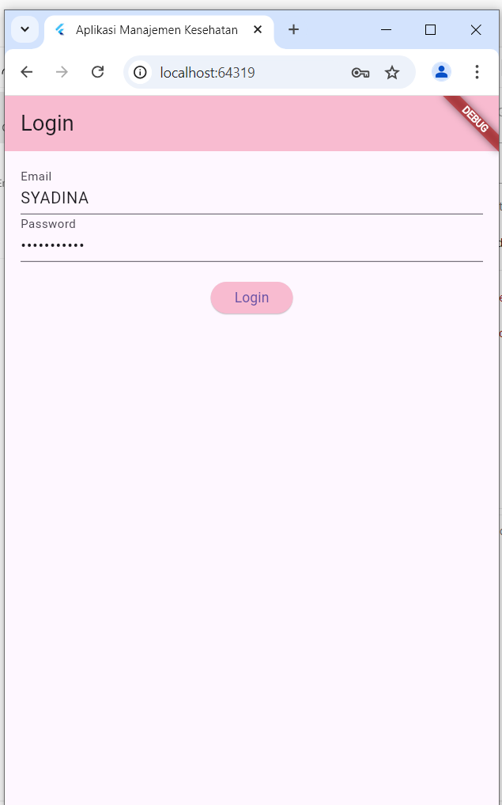

Penjelasan Program : 

1. main.dart
   Kegunaan:

sebagai file utama yang digunakan untuk menjalankan aplikasi Flutter. 
digunakan untuk mengarahkan ke halaman pertama yang akan ditampilkan ketika aplikasi dibuka, seperti halaman login atau halaman utama.

2. Folder Models 
models/riwayat_alergi.dart
Kegunaan:

File ini mendefinisikan struktur data untuk  Riwayat Alergi, yang menyimpan informasi tentang alergi pengguna seperti nama alergen, reaksi, dan tingkat keparahan.
Model ini juga dilengkapi dengan metode untuk mengubah data dari dan ke format JSON, yang diperlukan saat berkomunikasi dengan API.

3. Folder Services
   Kegunaan:

File ini berisi semua fungsi yang berhubungan dengan CRUD untuk riwayat_alergi. Misalnya, mendapatkan daftar riwayat alergi, menambah, memperbarui, atau menghapus data alergi dari API.
Ini berinteraksi dengan API menggunakan metode HTTP seperti GET, POST, PUT, dan DELETE.
Contoh Fungsi:

getAllRiwayatAlergi(): Mengambil semua data alergi.
createRiwayatAlergi(RiwayatAlergi alergi): Menambah riwayat alergi baru ke server.
updateRiwayatAlergi(RiwayatAlergi alergi): Memperbarui data alergi yang ada.

4. Folder Screens
a. login_screen.dart
   Kegunaan:

File ini menampilkan antarmuka untuk login pengguna. Biasanya terdiri dari formulir dengan input untuk email/username dan password, serta tombol untuk melakukan login.
Mengirimkan data login ke API untuk otentikasi pengguna dan, jika berhasil, mengarahkan pengguna ke halaman utama aplikasi.
Contoh Fungsi:

Validasi input login.
Mengirimkan request login ke API.
Menyimpan token autentikasi jika login berhasil.

b. register_screen.dart
Kegunaan:

Halaman ini berisi formulir untuk registrasi pengguna baru. Pengguna bisa memasukkan data seperti username, email, dan password untuk membuat akun.
Setelah data registrasi dikirimkan, halaman ini memproses respons dari API (misalnya, berhasil atau gagal registrasi).
Contoh Fungsi:

Validasi input registrasi.

c. alergi_list_screen.dart
Kegunaan:

Menampilkan daftar semua riwayat alergi yang diambil dari server (menggunakan service).
Pengguna dapat melihat detail, menambah, menghapus, atau memperbarui riwayat alergi dari halaman ini.
Contoh Fungsi:

Mengambil semua data riwayat alergi menggunakan service.

5. Folder Widgets
   Folder ini digunakan untuk menyimpan widget yang bisa digunakan ulang dalam aplikasi.

File ini mungkin berisi definisi untuk widget tombol kustom, yang bisa digunakan di beberapa tempat di aplikasi. 

Screenshoot Program :

